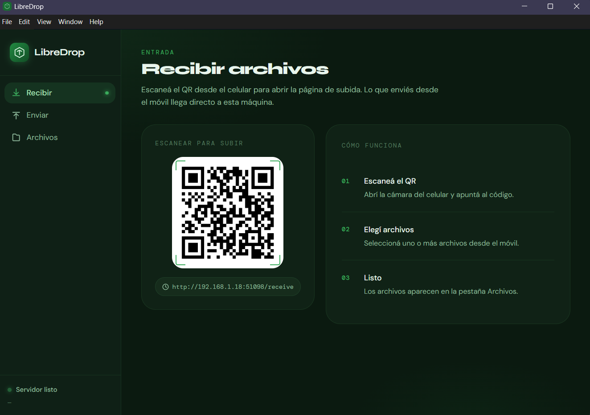
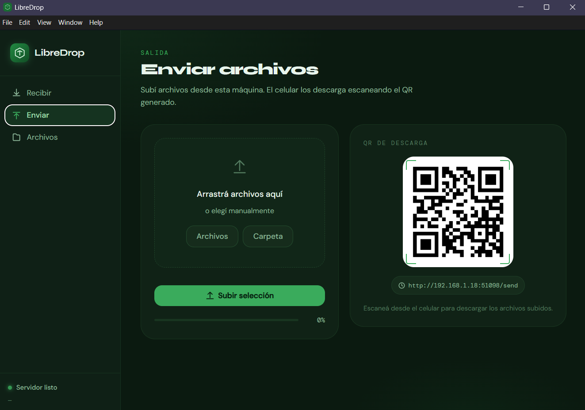
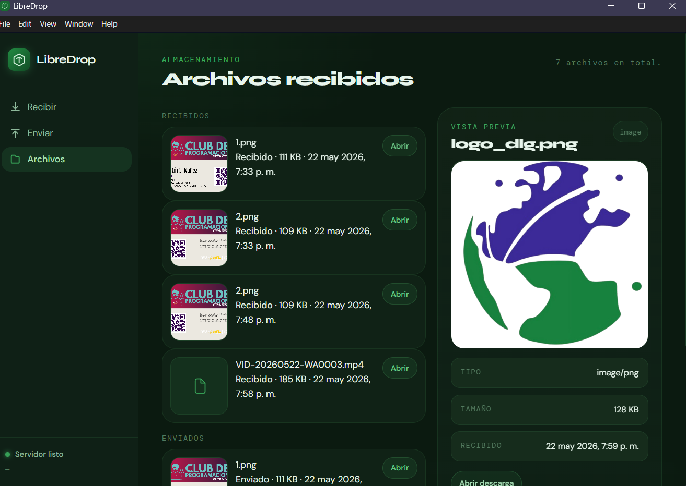
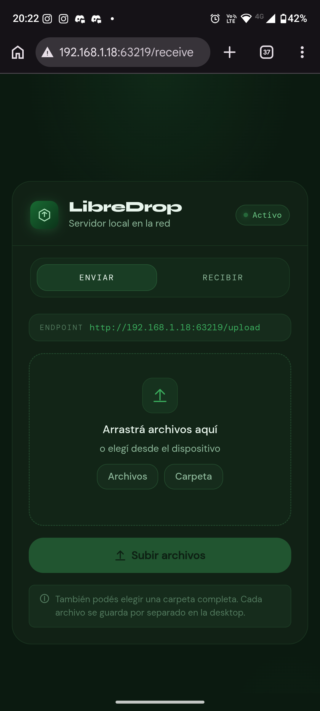
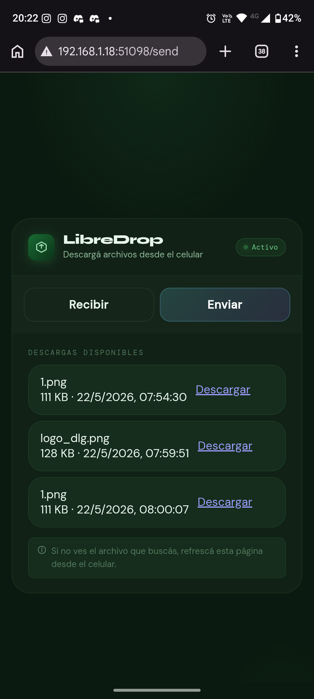

# LibreDrop

LibreDrop es una app de transferencia local de archivos pensada para compartir contenido entre una PC y un celular dentro de la misma red, sin depender de servicios externos ni subir nada a la nube.

El proyecto combina una interfaz desktop en Electron con un servidor Express local que genera QR para acceder desde el móvil. Desde la computadora podés recibir archivos, enviar archivos y revisar todo lo que ya pasó por la app.

## Qué resuelve

- Compartir archivos entre dispositivos en la misma red local.
- Evitar pasos manuales de copiar URLs o configurar servidores externos.
- Usar un flujo simple: abrir la app, escanear el QR y transferir.
- Mantener un historial visual de archivos recibidos y enviados.

## Características

- Interfaz desktop en Electron con navegación por pestañas.
- Servidor local Express que expone las rutas de transferencia.
- QR dinámico para las pantallas de recibir y enviar.
- Subida desde desktop por drag and drop, selección de archivos o carpetas.
- Vista previa de archivos recibidos en la pestaña Archivos.
- Descarga directa de archivos enviados desde el celular.
- Persistencia local del historial en `uploads/files.json`.
- Diseño adaptado a desktop y versión mobile servida desde el propio servidor.

## Cómo funciona

1. Al iniciar la app, Electron levanta un servidor local.
2. El servidor expone dos URLs principales:
   - `/receive` para enviar archivos al equipo.
   - `/send` para descargar archivos cargados desde la desktop.
3. La ventana desktop genera los QR para esas rutas y muestra el estado del servidor.
4. El celular abre la web local, sube o descarga archivos y vuelve a la misma sesión sin repetir el escaneo.

## Tecnologías

- Electron
- Express
- Multer
- qrcode
- CORS
- HTML, CSS y JavaScript sin framework

## Imagenes

### Recibir archivos desde la app


### Enviar Archivos desde la app


### Ver archivos


<h3>Vista web</h3>

<div style="display:flex; gap:12px;">
  
  
  
</div>
Nota : Me di cuenta que esta mal el recibir y enviar en la foto de la derecha deberia estar invertido jeje. 

## Requisitos

- Windows, macOS o Linux con soporte para Electron.
- Node.js instalado.
- Dispositivos conectados a la misma red local para usar el flujo móvil.

## Instalación

```bash
npm install
```

## Ejecución

```bash
npm start
```

La app abre la ventana desktop y arranca el servidor local automáticamente.

## Uso

### Recibir archivos desde el celular

1. Abrí LibreDrop en la computadora.
2. En la pestaña Recibir, escaneá el QR desde el celular.
3. Subí uno o varios archivos.
4. Los archivos quedan guardados en la máquina y aparecen en la pestaña Archivos.

### Enviar archivos desde la computadora

1. Pasá a la pestaña Enviar en la desktop o en el menú móvil.
2. Arrastrá archivos o elegí archivos y carpetas.
3. Subilos a la sesión local.
4. Desde el celular, abrí la ruta de descarga o escaneá el QR de descarga.

### Revisar archivos recibidos

1. Abrí la pestaña Archivos.
2. Seleccioná un archivo para ver su vista previa.
3. Usá el enlace de descarga si querés abrirlo en otra pestaña.

## Estructura del proyecto

```text
main.js
preload.js
server.js
renderer/
	index.html
	renderer.js
	styles.css
uploads/
	files.json
```

## Estructura técnica

- `main.js` crea la ventana desktop, define el tamaño inicial y pasa al renderer los QR generados.
- `server.js` levanta el servidor local, maneja subidas, descargas y la persistencia de archivos.
- `preload.js` expone el canal seguro para recibir el estado del servidor desde Electron.
- `renderer/index.html` define la interfaz principal.
- `renderer/renderer.js` controla la navegación, el render de archivos y la vista previa.
- `renderer/styles.css` contiene el sistema visual de la app desktop.

## Datos locales

LibreDrop guarda información solo en tu equipo:

- Los archivos subidos se almacenan dentro de `uploads/`.
- El historial se mantiene en `uploads/files.json`.
- No hay dependencia obligatoria de internet para transferir archivos dentro de la red local.

## Notas de red

- El celular y la computadora deben estar en la misma red.
- Si el QR no abre, revisá el firewall del sistema o las reglas de red local.
- Si la IP cambia, reiniciá la app para regenerar las URLs.

## Desarrollo

Si querés modificar la interfaz, el flujo principal está en estos archivos:

- `renderer/index.html` para la estructura.
- `renderer/styles.css` para el diseño.
- `renderer/renderer.js` para la lógica de interacción.
- `main.js` para el comportamiento de la ventana desktop.
- `server.js` para el comportamiento de backend local.

## Contribuir

Las contribuciones son bienvenidas. Si querés aportar, idealmente:

- Abrí un issue describiendo el cambio o problema.
- Mantené el estilo visual y técnico existente.
- Probá el flujo completo de desktop y móvil antes de enviar un cambio.

## Próximas ideas

- Previsualización de texto y markdown dentro del panel de archivos.
- Mejoras en la barra de estado y feedback de conexión.
- Soporte para más tipos de archivo en el panel de vista previa.
- Mejoras en accesibilidad y navegación por teclado.

## Licencia

LibreDrop está publicado bajo licencia MIT.
